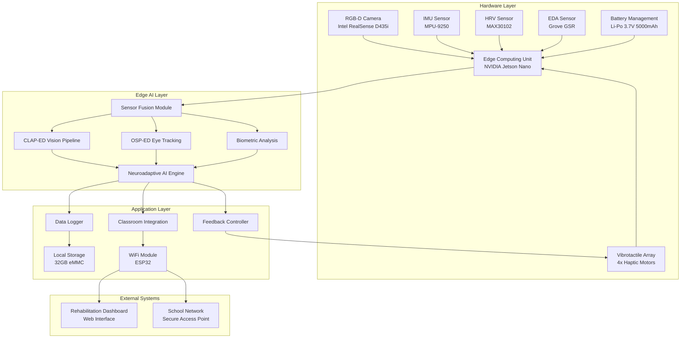
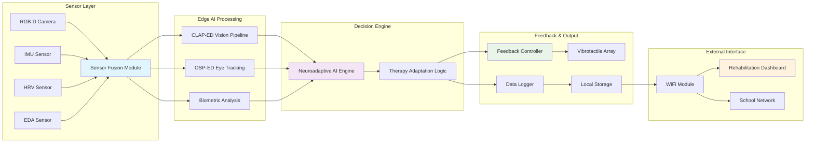
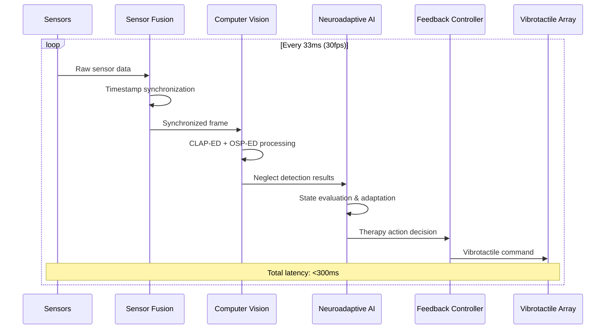

# System Design Document: AURA-EDU Wearable System

## Overview

The AURA-EDU (AI-powered Unified Rehabilitation Assistant for Educational environments) system is a neuroadaptive wearable prototype designed for real-time spatial neglect rehabilitation in classroom settings. This design document outlines a technically sound yet achievable hackathon prototype architecture that demonstrates core functionality while maintaining realistic implementation constraints.

The system integrates computer vision, biometric monitoring, and adaptive AI in a single wearable device that provides discrete rehabilitation support during regular classroom activities. The architecture prioritizes edge processing for privacy, modular design for rapid prototyping, and classroom integration for real-world applicability.

## Architecture

### High-Level System Architecture

The AURA-EDU system follows a layered architecture with clear separation of concerns:



### Component Selection Rationale

**Edge Computing Unit: NVIDIA Jetson Nano**
- ARM Cortex-A57 quad-core CPU with 128-core Maxwell GPU
- 4GB LPDDR4 RAM sufficient for real-time AI inference
- Native support for TensorRT optimization
- Power consumption: 5-10W (manageable for wearable)
- Cost: ~$100 (within hackathon budget constraints)

**RGB-D Camera: Intel RealSense D435i**
- 1280x720 RGB at 30fps with depth sensing
- Built-in IMU for additional motion data
- USB 3.0 interface with low latency
- Compact form factor suitable for head-mounted configuration
- Cost: ~$200 (justified by dual RGB-D + IMU functionality)

**Biometric Sensors:**
- MAX30102: Integrated heart rate and SpO2 sensor with I2C interface
- MPU-9250: 9-axis IMU with accelerometer, gyroscope, magnetometer
- Grove GSR: Electrodermal activity sensor with analog output
- Total sensor cost: ~$50 (cost-effective for prototype validation)

### System Data Flow Diagram

The following diagram illustrates the high-level end-to-end data flow through the AURA-EDU system:



**Data Flow Summary:**
1. **Sensors** capture multi-modal data (visual, motion, biometric)
2. **Sensor Fusion** synchronizes and preprocesses all inputs
3. **Edge AI** processes data through computer vision and biometric analysis
4. **Decision Engine** uses neuroadaptive AI to determine optimal interventions
5. **Feedback System** delivers personalized vibrotactile responses
6. **Dashboard** provides secure access to rehabilitation progress and analytics

## Components and Interfaces

### Sensor Fusion Module

**Purpose:** Synchronize and preprocess all sensor inputs with millisecond precision timestamps.

**Interface Specification:**
```python
class SensorFusionModule:
    def __init__(self):
        self.timestamp_sync = TimestampSynchronizer()
        self.data_buffer = CircularBuffer(size=1000)
    
    def process_sensor_data(self, sensor_data: Dict) -> SensorFrame:
        """
        Synchronizes multi-modal sensor inputs
        Returns: SensorFrame with aligned timestamps
        """
        pass
    
    def get_synchronized_frame(self) -> SensorFrame:
        """
        Returns: Latest synchronized sensor frame
        Latency: <10ms for real-time processing
        """
        pass
```

**Data Format:**
```json
{
    "timestamp": "2024-01-15T10:30:45.123Z",
    "rgb_frame": "base64_encoded_image",
    "depth_data": [640, 480, "uint16_array"],
    "imu_data": {
        "acceleration": [x, y, z],
        "gyroscope": [x, y, z],
        "magnetometer": [x, y, z]
    },
    "hrv_data": {
        "heart_rate": 72,
        "hrv_rmssd": 45.2
    },
    "eda_data": {
        "conductance": 2.3,
        "arousal_level": 0.6
    }
}
```

### CLAP-ED Vision Pipeline

**Purpose:** Computer vision-based Left-side Attention Pattern detection for spatial neglect identification.

**Technical Implementation:**
- YOLOv5s model optimized for TensorRT inference
- Input: 640x480 RGB frames at 30fps
- Processing time: <100ms per frame on Jetson Nano
- Output: Attention heatmap with neglect probability scores

**Algorithm Flow:**
1. **Preprocessing:** Frame normalization and region-of-interest extraction
2. **Object Detection:** YOLOv5s identifies classroom objects and stimuli
3. **Attention Mapping:** Spatial attention analysis using gaze estimation
4. **Neglect Detection:** Left-side attention deficit scoring
5. **Confidence Scoring:** Reliability assessment for intervention triggering

**Interface:**
```python
class CLAPEDPipeline:
    def __init__(self, model_path: str):
        self.model = TensorRTModel(model_path)
        self.attention_tracker = AttentionTracker()
    
    def detect_spatial_neglect(self, rgb_frame: np.ndarray) -> NeglectDetection:
        """
        Processes RGB frame for spatial neglect patterns
        Returns: NeglectDetection with confidence and spatial coordinates
        Latency: <100ms target
        """
        pass
```

### OSP-ED Eye Tracking System

**Purpose:** Ocular Saccade Pattern detection for educational environments using RGB-D camera data.

**Technical Approach:**
- MediaPipe Face Mesh for facial landmark detection
- Eye region extraction and pupil tracking
- Saccade pattern analysis for neglect indicators
- Calibration-free operation suitable for classroom use

**Implementation:**
```python
class OSPEDTracker:
    def __init__(self):
        self.face_mesh = MediaPipeFaceMesh()
        self.saccade_analyzer = SaccadeAnalyzer()
    
    def track_eye_movements(self, rgb_frame: np.ndarray) -> EyeTrackingData:
        """
        Extracts eye movement patterns from RGB frame
        Returns: Saccade data with neglect indicators
        Latency: <200ms target
        """
        pass
```

### Neuroadaptive AI Engine

**Purpose:** Reinforcement learning system that adapts rehabilitation protocols based on real-time performance.

**Architecture:**
- Q-learning agent with experience replay
- State space: Biometric data + performance metrics
- Action space: Feedback intensity, timing, and modality
- Reward function: Rehabilitation progress + user comfort

**Technical Specifications:**
- Model: Deep Q-Network (DQN) with 3-layer MLP
- Training: Online learning with 7-day experience windows
- Inference: <500ms for adaptation decisions
- Memory: 10MB model size for edge deployment

**Interface:**
```python
class NeuroadaptiveAI:
    def __init__(self, model_config: Dict):
        self.dqn_agent = DQNAgent(model_config)
        self.performance_tracker = PerformanceTracker()
    
    def adapt_therapy(self, current_state: SystemState) -> TherapyAction:
        """
        Determines optimal therapy adaptation based on current state
        Returns: TherapyAction with feedback parameters
        Latency: <500ms target
        """
        pass
```

### Feedback Controller

**Purpose:** Manages vibrotactile feedback delivery with graduated intensity and pattern control.

**Hardware Configuration:**
- 4x Linear Resonant Actuators (LRAs) positioned around head-mounted device
- PWM control via GPIO pins on Jetson Nano
- Frequency range: 20-200Hz for varied tactile sensations
- Amplitude control: 0-100% intensity scaling

**Feedback Patterns:**
- **Attention Redirect:** 50Hz, 200ms pulse on neglected side
- **Positive Reinforcement:** 80Hz, 100ms gentle confirmation
- **Emergency Alert:** 150Hz, 500ms distinctive pattern
- **Exponential Backoff:** Automatic intensity reduction for overload prevention

## Data Models

### Core Data Structures

**SensorFrame:**
```python
@dataclass
class SensorFrame:
    timestamp: datetime
    rgb_data: np.ndarray  # Shape: (480, 640, 3)
    depth_data: np.ndarray  # Shape: (480, 640)
    imu_data: IMUReading
    biometric_data: BiometricReading
    frame_id: int
    quality_score: float  # 0.0-1.0 data quality indicator
```

**NeglectDetection:**
```python
@dataclass
class NeglectDetection:
    detected: bool
    confidence: float  # 0.0-1.0
    spatial_coordinates: Tuple[int, int]  # Pixel coordinates
    severity_score: float  # 0.0-1.0
    affected_region: str  # "left", "right", "bilateral"
    detection_method: str  # "clap_ed", "osp_ed", "combined"
```

**TherapyAction:**
```python
@dataclass
class TherapyAction:
    feedback_type: str  # "vibrotactile", "none"
    intensity: float  # 0.0-1.0
    duration_ms: int
    frequency_hz: int
    spatial_location: str  # "left", "right", "bilateral"
    delay_ms: int  # Timing offset for optimal delivery
```

**RehabilitationSession:**
```python
@dataclass
class RehabilitationSession:
    session_id: str
    user_id: str  # Anonymized identifier
    start_time: datetime
    end_time: datetime
    neglect_episodes: List[NeglectDetection]
    therapy_actions: List[TherapyAction]
    biometric_summary: BiometricSummary
    performance_metrics: PerformanceMetrics
    ai_adaptations: List[AIAdaptation]
```

### Data Storage Schema

**Local SQLite Database:**
```sql
-- Sessions table for rehabilitation tracking
CREATE TABLE sessions (
    session_id TEXT PRIMARY KEY,
    user_id TEXT NOT NULL,
    start_time TIMESTAMP,
    end_time TIMESTAMP,
    total_neglect_episodes INTEGER,
    average_response_time_ms REAL,
    therapy_effectiveness_score REAL
);

-- Sensor data table for detailed analysis
CREATE TABLE sensor_data (
    id INTEGER PRIMARY KEY AUTOINCREMENT,
    session_id TEXT,
    timestamp TIMESTAMP,
    sensor_type TEXT,
    data_blob BLOB,  -- Compressed sensor readings
    quality_score REAL,
    FOREIGN KEY (session_id) REFERENCES sessions(session_id)
);

-- AI model performance tracking
CREATE TABLE model_performance (
    id INTEGER PRIMARY KEY AUTOINCREMENT,
    model_version TEXT,
    accuracy_score REAL,
    inference_time_ms REAL,
    update_timestamp TIMESTAMP
);
```

## End-to-End Data Flow

### Real-Time Processing Pipeline



### Data Processing Stages

**Stage 1: Sensor Data Acquisition (0-10ms)**
- RGB-D camera captures frame at 30fps
- IMU provides motion data at 100Hz
- Biometric sensors sampled at respective rates
- Hardware timestamps applied at acquisition

**Stage 2: Sensor Fusion (10-20ms)**
- Temporal alignment of multi-modal data
- Quality assessment and noise filtering
- Circular buffer management for real-time processing
- Frame packaging for downstream processing

**Stage 3: Computer Vision Processing (20-120ms)**
- CLAP-ED pipeline processes RGB data
- OSP-ED analyzes eye movement patterns
- Spatial attention mapping generation
- Neglect detection with confidence scoring

**Stage 4: AI Decision Making (120-170ms)**
- Current state evaluation using biometric context
- Q-learning agent determines optimal action
- Therapy adaptation based on performance history
- Safety checks for intervention appropriateness

**Stage 5: Feedback Delivery (170-200ms)**
- Vibrotactile pattern generation
- Hardware PWM signal transmission
- Feedback execution with precise timing
- Response logging for learning feedback

### Privacy-Preserving Data Handling

**On-Device Processing:**
- All AI inference performed locally on Jetson Nano
- No raw biometric data transmitted off-device
- Encrypted local storage using AES-256
- Secure key management with hardware security module

**Federated Learning Implementation:**
- Model updates using differential privacy
- Gradient aggregation without raw data sharing
- Local model personalization with global knowledge
- Privacy budget management for data contribution

## Hardware-Software Integration Strategy

### Wearable Form Factor Design

**Head-Mounted Configuration:**
- Lightweight frame design (<200g total weight)
- Adjustable mounting system for various head sizes
- Cable management for sensor connections
- Ventilation considerations for extended wear

**Component Integration:**
- Jetson Nano in custom enclosure with heat dissipation
- RGB-D camera mounted for optimal field-of-view
- Biometric sensors positioned for reliable contact
- Battery pack distributed for weight balance

### Power Management System

**Power Budget Analysis:**
- Jetson Nano: 5-10W (variable based on AI workload)
- RGB-D Camera: 2.5W continuous operation
- Sensors and peripherals: 1W combined
- Total system power: 8.5-13.5W

**Battery Configuration:**
- Li-Po 3.7V 5000mAh primary battery
- 8-hour operation target with power optimization
- USB-C charging with pass-through capability
- Battery management system with safety protection

**Power Optimization Strategies:**
- Dynamic frequency scaling based on workload
- Sensor duty cycling during low-activity periods
- AI model quantization for reduced computation
- Sleep mode activation during extended inactivity

### Thermal Management

**Heat Dissipation Design:**
- Passive cooling with aluminum heat spreaders
- Ventilation channels in enclosure design
- Thermal throttling protection for safety
- Temperature monitoring with user alerts

## Edge AI Inference Pipeline Design

### Model Optimization for Edge Deployment

**TensorRT Optimization:**
- YOLOv5s model converted to TensorRT format
- INT8 quantization for 2-4x speedup
- Dynamic batch sizing for variable workloads
- Memory optimization for 4GB RAM constraint

**Model Architecture:**
```python
class EdgeOptimizedModel:
    def __init__(self, model_path: str):
        self.trt_engine = TensorRTEngine(model_path)
        self.input_shape = (1, 3, 640, 480)  # NCHW format
        self.output_classes = 80  # COCO classes + custom neglect indicators
    
    def inference(self, input_tensor: torch.Tensor) -> torch.Tensor:
        """
        Optimized inference with <100ms latency
        Memory usage: <500MB during inference
        """
        pass
```

### Real-Time Inference Management

**Inference Scheduling:**
- Priority-based task scheduling for real-time constraints
- GPU memory management with buffer pooling
- Asynchronous processing pipeline for parallel execution
- Fallback mechanisms for overload conditions

**Performance Monitoring:**
- Inference time tracking with percentile analysis
- Memory usage monitoring with leak detection
- Model accuracy validation during operation
- Automatic model switching for performance degradation

### Adaptive Model Selection

**Multi-Model Architecture:**
- Lightweight model for continuous monitoring
- Full-precision model for detailed analysis
- Specialized models for different classroom contexts
- Dynamic switching based on computational budget

## Safety and Fault Tolerance Mechanisms

### Hardware Safety Systems

**Temperature Protection:**
- Continuous temperature monitoring at multiple points
- Automatic shutdown at 40°C skin contact temperature
- Thermal throttling with graceful performance degradation
- User notification system for overheating conditions

**Electrical Safety:**
- Isolated power domains for sensor circuits
- Overcurrent protection with automatic reset
- ESD protection for all external interfaces
- Medical-grade electrical isolation standards

### Software Fault Tolerance

**Watchdog Systems:**
- Hardware watchdog timer for system recovery
- Software watchdog for application monitoring
- Automatic restart with state preservation
- Fault logging for diagnostic analysis

**Graceful Degradation:**
```python
class FaultTolerantSystem:
    def __init__(self):
        self.subsystem_health = {}
        self.fallback_modes = {
            'camera_failure': 'imu_only_mode',
            'ai_failure': 'rule_based_mode',
            'sensor_failure': 'reduced_functionality_mode'
        }
    
    def handle_subsystem_failure(self, failed_component: str):
        """
        Implements graceful degradation strategies
        Maintains core functionality during partial failures
        """
        pass
```

### Data Integrity Protection

**Error Detection and Correction:**
- Checksums for all sensor data packets
- Redundant storage for critical configuration data
- Automatic data validation and sanitization
- Backup and recovery mechanisms for user data

**System State Management:**
- Atomic operations for critical state changes
- Transaction logging for state recovery
- Consistent state verification during startup
- Emergency state preservation during shutdown

## Privacy-First Design Principles

### Data Minimization

**Collection Principles:**
- Only collect data necessary for rehabilitation function
- Automatic data expiration after therapeutic relevance
- User consent granularity for different data types
- Opt-out mechanisms for non-essential data collection

**Processing Limitations:**
- On-device processing as primary approach
- Cloud processing only for anonymized aggregate data
- Purpose limitation for all data usage
- Regular data purging based on retention policies

### Encryption and Security

**Data Protection:**
```python
class PrivacyProtection:
    def __init__(self):
        self.encryption_key = self.generate_device_key()
        self.anonymization_engine = AnonymizationEngine()
    
    def encrypt_sensitive_data(self, data: Dict) -> bytes:
        """
        AES-256 encryption for all stored biometric data
        Key derivation from hardware-specific identifiers
        """
        pass
    
    def anonymize_for_research(self, session_data: RehabilitationSession) -> Dict:
        """
        Differential privacy for research data sharing
        K-anonymity preservation for group analysis
        """
        pass
```

### Consent Management

**User Control Systems:**
- Granular consent for different data types
- Real-time consent modification capabilities
- Clear data usage transparency
- Parental consent integration for minors

## Technical Differentiators

AURA-EDU represents a significant technical advancement over traditional rehabilitation systems through several key innovations:

• **Real-Time Edge AI Processing**: Unlike clinic-based systems requiring cloud connectivity, AURA-EDU performs all AI inference locally on NVIDIA Jetson Nano, enabling <100ms response times while maintaining complete privacy

• **Multi-Modal Sensor Fusion**: Integrates RGB-D computer vision, 9-axis IMU tracking, heart rate variability, and electrodermal activity in a single wearable device with millisecond-precision synchronization

• **Neuroadaptive Reinforcement Learning**: Employs Q-learning algorithms that continuously adapt rehabilitation protocols based on real-time biometric feedback and performance data, personalizing therapy intensity and timing

• **Classroom-Integrated Operation**: Designed specifically for educational environments with discrete haptic feedback, 8-hour battery life, and automatic intervention pausing during attention-critical activities

• **Privacy-First Architecture**: Implements federated learning for model improvements while ensuring all personal data remains on-device, with AES-256 encryption and FERPA/COPPA compliance

• **Scalable Prototype Design**: Targets <$500 per unit cost with support for 5 concurrent devices per access point, making advanced rehabilitation technology accessible in resource-constrained educational settings

## Implementation Roadmap

### Phase 1: Core Hardware Integration (Weeks 1-2)
- Jetson Nano setup and optimization
- RGB-D camera integration and calibration
- Basic sensor fusion implementation
- Power management system validation

### Phase 2: Computer Vision Pipeline (Weeks 3-4)
- CLAP-ED algorithm implementation
- OSP-ED eye tracking integration
- Real-time processing optimization
- Accuracy validation with test datasets

### Phase 3: AI and Feedback Systems (Weeks 5-6)
- Neuroadaptive AI engine development
- Vibrotactile feedback controller implementation
- Closed-loop system integration
- Performance optimization and testing

### Phase 4: Integration and Validation (Weeks 7-8)
- Complete system integration testing
- Classroom environment validation
- Safety and reliability testing
- Documentation and demonstration preparation

### Technology Stack Summary

**Hardware Platform:**
- NVIDIA Jetson Nano (Edge AI processing)
- Intel RealSense D435i (RGB-D + IMU)
- MAX30102 (Heart rate variability)
- MPU-9250 (Additional IMU data)
- Grove GSR (Electrodermal activity)
- Custom vibrotactile array (4x LRA motors)

**Software Framework:**
- Ubuntu 18.04 LTS (Jetson Nano OS)
- Python 3.8 with PyTorch 1.9
- TensorRT 8.0 for model optimization
- OpenCV 4.5 for computer vision
- SQLite for local data storage
- Flask for web dashboard interface

**AI/ML Libraries:**
- YOLOv5 for object detection
- MediaPipe for face/eye tracking
- Stable-Baselines3 for reinforcement learning
- Scikit-learn for biometric analysis
- NumPy/Pandas for data processing

This design provides a comprehensive yet achievable architecture for a hackathon prototype that demonstrates the core AURA-EDU functionality while maintaining realistic implementation constraints and technical feasibility.

## Correctness Properties

*A property is a characteristic or behavior that should hold true across all valid executions of a system—essentially, a formal statement about what the system should do. Properties serve as the bridge between human-readable specifications and machine-verifiable correctness guarantees.*

The following properties define the correctness requirements for the AURA-EDU system, derived from the acceptance criteria in the requirements document. Each property is designed to be testable through property-based testing with universal quantification.

### Performance and Latency Properties

**Property 1: Real-time processing latency**
*For any* RGB-D frame captured by the system, CLAP-ED processing should complete within 200ms
**Validates: Requirements 1.1**

**Property 2: Eye tracking processing latency**
*For any* eye movement data captured by OSP-ED, saccade pattern analysis should complete within 500ms
**Validates: Requirements 1.3**

**Property 3: Therapy adaptation responsiveness**
*For any* detected performance change, the system should adjust therapy difficulty within 1000ms
**Validates: Requirements 2.2**

**Property 4: Emergency alert timing**
*For any* emergency situation requiring attention, the system should provide distinctive alert patterns recognizable within 1000ms
**Validates: Requirements 7.5**

### Detection and Accuracy Properties

**Property 5: Spatial neglect detection accuracy**
*For any* test dataset with known ground truth, the system should identify missed stimuli with at least 60% accuracy in controlled conditions
**Validates: Requirements 1.2**

**Property 6: AI model accuracy threshold**
*For any* trained Neuroadaptive AI model, spatial neglect detection accuracy should achieve minimum 60% on validation datasets
**Validates: Requirements 10.2**

**Property 7: Sensor accuracy under interference**
*For any* electromagnetic interference scenario, sensor accuracy should remain within 10% of baseline performance
**Validates: Requirements 9.4**

### Data Logging and Completeness Properties

**Property 8: Neglect episode logging completeness**
*For any* detected neglect episode, the system should log incident data containing timestamp, severity score, and spatial coordinates
**Validates: Requirements 1.4**

**Property 9: Biometric data synchronization**
*For any* sensor input collection period, all sensor data should be synchronized with millisecond precision timestamps
**Validates: Requirements 6.4**

**Property 10: Research data collection**
*For any* rehabilitation session, the system should collect data suitable for correlating rehabilitation progress with academic task completion
**Validates: Requirements 12.5**

### Privacy and Security Properties

**Property 11: Local processing guarantee**
*For any* visual data processing operation, all analysis should be performed on-device without external data transmission
**Validates: Requirements 1.5, 4.1**

**Property 12: Data encryption compliance**
*For any* stored rehabilitation data, all local storage should use AES-256 encryption
**Validates: Requirements 4.3**

**Property 13: Anonymization completeness**
*For any* shared progress report, all personally identifiable information should be anonymized before transmission
**Validates: Requirements 4.4**

**Property 14: Privacy-preserving diagnostics**
*For any* system diagnostic data transmission, individual user patterns should not be exposed
**Validates: Requirements 4.5**

**Property 15: Educational privacy compliance**
*For any* student data handling operation, the system should implement FERPA and COPPA-compliant privacy protections
**Validates: Requirements 13.1**

### Feedback and Intervention Properties

**Property 16: Vibrotactile feedback parameters**
*For any* detected spatial neglect event, the system should provide graduated vibrotactile feedback starting at 20Hz frequency
**Validates: Requirements 7.1**

**Property 17: Positive reinforcement delivery**
*For any* successful attention redirection, the system should provide positive reinforcement through gentle haptic confirmation
**Validates: Requirements 7.2**

**Property 18: Exponential backoff implementation**
*For any* sequence of rapidly occurring neglect episodes, the system should implement exponential backoff to prevent sensory overload
**Validates: Requirements 7.3**

**Property 19: Adaptive feedback reduction**
*For any* detected user performance improvement, the system should gradually reduce feedback intensity to promote independence
**Validates: Requirements 7.4**

### Classroom Integration Properties

**Property 20: Audio feedback limitation**
*For any* operation in classroom mode, the system should limit feedback to haptic vibrotactile stimulation only (no audio output)
**Validates: Requirements 3.1**

**Property 21: Discrete vibration patterns**
*For any* rehabilitation cue delivery, vibration patterns should be imperceptible to others beyond 1 meter distance
**Validates: Requirements 3.2**

**Property 22: Intervention pausing**
*For any* classroom activity requiring attention, the system should automatically pause non-essential rehabilitation interventions
**Validates: Requirements 3.3**

### System Reliability Properties

**Property 23: Uptime reliability**
*For any* 4-hour continuous operation period, the system should maintain 85% uptime during school sessions
**Validates: Requirements 9.1**

**Property 24: Graceful degradation**
*For any* hardware failure scenario, the system should implement graceful degradation while preserving core functionality
**Validates: Requirements 9.2**

**Property 25: Temperature safety**
*For any* skin contact scenario, the system should monitor temperature and prevent overheating above 40°C
**Validates: Requirements 9.3**

**Property 26: Error logging and alerting**
*For any* detected system error, the system should log diagnostic information and alert technical support automatically
**Validates: Requirements 9.5**

### Sensor Performance Properties

**Property 27: HRV sampling rate consistency**
*For any* physiological monitoring period, the HRV sensor should maintain 50Hz sampling rate
**Validates: Requirements 6.1**

**Property 28: EDA response timing**
*For any* stimulus presentation, the EDA sensor should detect electrodermal activity changes within 1000ms
**Validates: Requirements 6.2**

**Property 29: IMU accuracy specification**
*For any* head movement tracking scenario, the IMU sensor should provide 9-axis motion data with 5-degree accuracy
**Validates: Requirements 6.3**

### Adaptive AI Properties

**Property 30: Protocol generation capability**
*For any* baseline cognitive performance data, the Neuroadaptive AI should create personalized rehabilitation protocols using Q-learning algorithms
**Validates: Requirements 2.1**

**Property 31: Biometric-based optimization**
*For any* rehabilitation session with HRV and EDA data, the Neuroadaptive AI should optimize feedback timing and intensity based on sensor inputs
**Validates: Requirements 2.3**

**Property 32: Strategy modification on effectiveness decline**
*For any* detected therapy effectiveness decrease, the system should automatically modify intervention strategies to maintain engagement
**Validates: Requirements 2.4**

**Property 33: Long-term model updates**
*For any* 7-day performance window, the Neuroadaptive AI should update rehabilitation models using reinforcement learning
**Validates: Requirements 2.5**

### Network and Scalability Properties

**Property 34: Wireless connectivity capacity**
*For any* classroom deployment scenario, the system should support wireless connectivity for up to 5 devices per access point
**Validates: Requirements 5.2**

**Property 35: Battery life requirement**
*For any* normal classroom usage pattern, the system should operate for minimum 4 hours on single charge
**Validates: Requirements 5.4**

**Property 36: Simultaneous firmware updates**
*For any* connected device group, the system should support over-the-air firmware updates for all devices simultaneously
**Validates: Requirements 5.5**

### Dashboard and Reporting Properties

**Property 37: Real-time metrics display**
*For any* patient data access request, the Rehabilitation Dashboard should display real-time rehabilitation metrics through secure web interface
**Validates: Requirements 8.1**

**Property 38: Statistical report generation**
*For any* progress analysis request, the Rehabilitation Dashboard should generate reports with statistical significance testing
**Validates: Requirements 8.2**

**Property 39: Concurrent session management**
*For any* multi-patient monitoring scenario, the Rehabilitation Dashboard should support up to 5 active users concurrently
**Validates: Requirements 8.4**

**Property 40: Standard format exports**
*For any* report generation request, the system should export data in standard healthcare formats (HL7 FHIR, CSV, PDF)
**Validates: Requirements 8.5**

### Safety and Emergency Properties

**Property 41: Emergency alert capability**
*For any* emergency situation, the system should provide immediate alert capabilities to designated classroom personnel
**Validates: Requirements 3.4**

**Property 42: Physiological distress response**
*For any* detected physiological distress, the system should automatically reduce rehabilitation intensity and alert supervising personnel
**Validates: Requirements 6.5**

### Data Consistency and Research Properties

**Property 43: Anonymized dataset generation**
*For any* rehabilitation data collection, the system should generate anonymized datasets suitable for research analysis
**Validates: Requirements 10.1**

**Property 44: Cross-version data consistency**
*For any* software update or hardware revision, the system should maintain data consistency for longitudinal studies
**Validates: Requirements 10.4**

**Property 45: Federated learning privacy preservation**
*For any* research insight generation, the system should contribute to federated learning networks while preserving individual privacy
**Validates: Requirements 10.5**

## Error Handling

### Sensor Failure Recovery

**Camera Failure Handling:**
- Automatic fallback to IMU-only spatial tracking
- Graceful degradation with reduced functionality notification
- Continuous monitoring for camera recovery
- User notification of limited functionality mode

**Biometric Sensor Failures:**
- Individual sensor failure isolation without system shutdown
- Adaptive AI operation with reduced input dimensionality
- Automatic sensor health monitoring and diagnostics
- Fallback to rule-based intervention when AI inputs are insufficient

**Network Connectivity Issues:**
- Local operation continuation during network outages
- Automatic data synchronization upon connectivity restoration
- Offline mode with full rehabilitation functionality
- Emergency communication protocols for critical alerts

### AI Model Failures

**Inference Pipeline Errors:**
- Automatic model validation before inference execution
- Fallback to simpler rule-based detection algorithms
- Model corruption detection and automatic recovery
- Performance degradation alerts with diagnostic information

**Memory and Computational Overload:**
- Dynamic model complexity reduction under resource constraints
- Automatic garbage collection and memory optimization
- Priority-based processing for critical safety functions
- Thermal throttling with graceful performance scaling

### Data Integrity Protection

**Storage Corruption Handling:**
- Automatic data validation using checksums
- Redundant storage for critical configuration data
- Atomic write operations for session data
- Automatic backup and recovery mechanisms

**Privacy Breach Prevention:**
- Real-time monitoring for unauthorized data access attempts
- Automatic encryption key rotation for long-term deployments
- Secure deletion of expired data with cryptographic erasure
- Audit logging for all data access and modification operations

## Testing Strategy

### Dual Testing Approach

The AURA-EDU system requires comprehensive testing through both unit testing and property-based testing approaches. These methodologies are complementary and together provide comprehensive coverage of system correctness.

**Unit Testing Focus:**
- Specific examples demonstrating correct behavior
- Edge cases and boundary conditions
- Integration points between hardware and software components
- Error conditions and recovery mechanisms
- Specific classroom scenarios and user interactions

**Property-Based Testing Focus:**
- Universal properties that hold across all valid inputs
- Comprehensive input coverage through randomization
- Correctness validation for AI model behavior
- System reliability under varied operational conditions
- Privacy and security guarantee verification

### Property-Based Testing Configuration

**Testing Framework Selection:**
- **Python**: Hypothesis library for property-based testing
- **Minimum 100 iterations** per property test due to randomization requirements
- **TensorRT optimization testing** using custom property generators
- **Biometric data simulation** with physiologically realistic ranges

**Property Test Implementation Requirements:**
- Each correctness property must be implemented by a single property-based test
- Test tagging format: **Feature: aura-edu-wearable, Property {number}: {property_text}**
- Automatic test data generation for sensor inputs, user scenarios, and system states
- Statistical validation of AI model performance across property test runs

**Example Property Test Structure:**
```python
@given(rgb_frames=sensor_data_strategy(), 
       processing_loads=st.floats(0.1, 0.9))
def test_clap_ed_processing_latency(rgb_frames, processing_loads):
    """
    Feature: aura-edu-wearable, Property 1: Real-time processing latency
    For any RGB-D frame, CLAP-ED processing should complete within 100ms
    """
    start_time = time.time()
    result = clap_ed_pipeline.process_frame(rgb_frames)
    processing_time = (time.time() - start_time) * 1000  # Convert to ms
    
    assert processing_time < 100, f"Processing took {processing_time}ms, exceeds 100ms limit"
    assert result.is_valid(), "Processing should produce valid results"
```

### Hardware-in-the-Loop Testing

**Sensor Integration Testing:**
- Real-time data acquisition validation with actual sensors
- Timing precision verification for multi-sensor synchronization
- Environmental condition testing (temperature, EMI, lighting)
- Long-duration reliability testing for 8-hour operation cycles

**AI Model Validation:**
- Controlled spatial neglect scenario testing with known ground truth
- Cross-validation using standardized cognitive assessment datasets
- Performance benchmarking against clinical rehabilitation metrics
- Adversarial testing for robustness under edge conditions

### Privacy and Security Testing

**Data Protection Validation:**
- Encryption verification for all stored data
- Network traffic analysis to confirm local processing
- Anonymization effectiveness testing with re-identification attempts
- Federated learning privacy preservation validation

**Regulatory Compliance Testing:**
- FERPA compliance verification for educational data handling
- COPPA compliance testing for child data protection
- Medical device safety standard validation (FDA guidance)
- Accessibility compliance testing for educational environments

### Performance and Reliability Testing

**Real-time Performance Validation:**
- Latency measurement across all processing pipelines
- Throughput testing under maximum sensor data rates
- Memory usage profiling during extended operation
- Battery life validation under various usage patterns

**Fault Tolerance Testing:**
- Systematic component failure simulation
- Recovery time measurement for various failure scenarios
- Data integrity verification during power interruptions
- Graceful degradation validation with reduced functionality

### Classroom Integration Testing

**Environmental Validation:**
- Noise level measurement for discrete operation verification
- Electromagnetic compatibility testing in school environments
- Multi-device interference testing with up to 15 concurrent units
- Integration testing with existing school network infrastructure

**User Experience Validation:**
- Ergonomic comfort testing for 8-hour wear periods
- Feedback effectiveness measurement in simulated classroom scenarios
- Teacher and student acceptance testing for classroom disruption assessment
- Emergency protocol testing with school personnel

This comprehensive testing strategy ensures that the AURA-EDU system meets all functional, safety, privacy, and performance requirements while maintaining the reliability necessary for educational deployment.